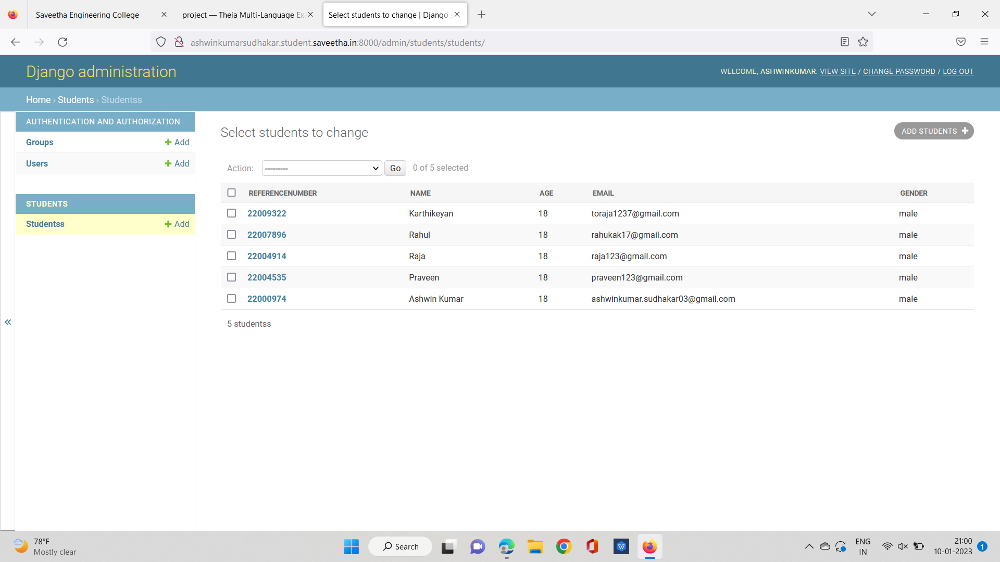

# Django ORM Web Application

## AIM
To develop a Django application to store and retrieve data from a database using Object Relational Mapping(ORM).

## Entity Relationship Diagram

Include your ER diagram here


## DESIGN STEPS

### STEP 1:
create the django domain


### STEP 2:
then from the the django.db import the models and then from the django.contribute import the admin

### STEP 3:

then create your own model by defining the class and with the respective comment

## PROGRAM
```from django.db import models
from django.contrib import admin

class students(models.Model):
    Referencenumber = models.CharField(max_length = 200, primary_key=True)
    name= models.CharField(max_length = 200)
    age = models.IntegerField()
    email = models.TextField()
    gender=models.CharField(max_length = 200)
class studentAdmin(admin.ModelAdmin):
    list_display = ('Referencenumber','name','age','email','gender')
```
### OUTPUT



## RESULT
By this program Django ORM has been created.